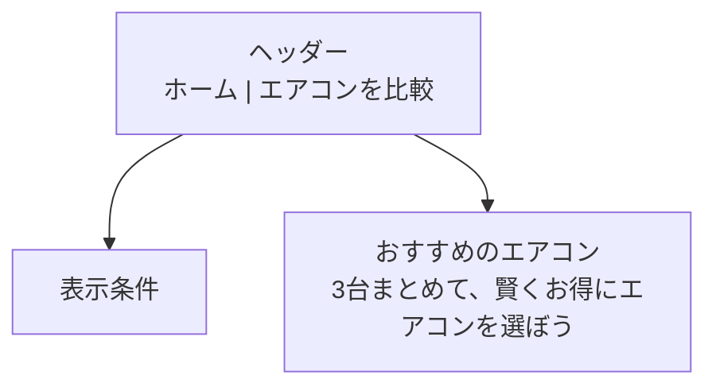
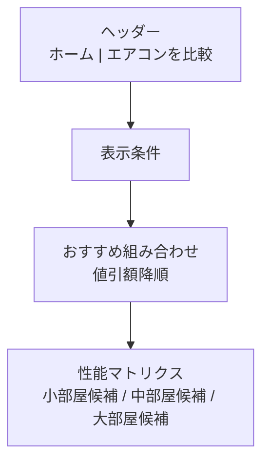

# ３台まとめ買いエアコン比較サイトのCodex実装仕様

## 要点

このサイトは、**検索サイト**ではなく、**固定シナリオを毎日更新する比較サイト**にした方が最小コストで目的に合います。理由は、今回の要件が「入力なし」「3台まとめ買い」「どの時期にどの店が得か」「性能は比較タブで見る」に完全に寄っているからです。したがって、Codex に渡すべきデータも **商品マスタ** と **店舗オファー** と **工事/撤去ルール** と **キャンペーン** に分け、UI には **同一店舗で3台買う前提のおすすめ順** をそのまま出す構成が最短です。

2026-05-02 時点の現行施策を見ると、entity["company","ヤマダデンキ","electronics retailer jp"]は 2026-04-24〜2026-05-10 の期間、指定エアコンを **2台で1万ポイント、3台以上で2万ポイント** 付与し、**同一会員番号・同一住所・2026-06-10 までの工事完了** を条件にしています。entity["company","ヨドバシカメラ","electronics retailer jp"]は 2026-05-10 までの GW セールに加え、**節電エアコンのまとめ買いで追加ポイント** を告知しており、商品によっては通常還元に上乗せで **1万〜2万ポイント級のボーナス例** が出ています。entity["company","ビックカメラ","electronics retailer jp"]は 2026-05-06 までの GW オンラインセールと、**指定エアコン購入＋リサイクル申込で最大3万円引き** の買い替え施策を出しています。したがってホーム画面は「固定の店名を勝者にする」のではなく、**対象機種条件を満たすかどうかで勝者が入れ替わる** 前提にすべきです。citeturn33view0turn27search1turn27search5turn27search9turn26search2turn26search10turn27search2turn27search6

定価比較については、メーカー公式が一律ではありません。entity["company","パナソニック","electronics maker jp"]の 2026 モデル比較ページは、畳数、冷房能力、冷房消費電力、年間消費電力量、省エネ基準達成率、APF を数表で持ちながら、価格は **オープン価格** の扱いです。一方、entity["company","ダイキン工業","air conditioner maker jp"]の 2026 モデル公式カタログは、**価格の数値**、畳数目安、能力、消費電力、低温暖房能力まで明示しています。よって Codex 用スキーマには `list_price_yen` だけでなく、**`list_price_type: exact | open | unknown`** を必須で持たせる必要があります。これがないと「定価3台との差額」を正しく計算できません。citeturn13view0turn14view0turn2view5

また、工事費と撤去費は店舗差が大きく、しかも商品ページ上の個別条件で上書きされるため、表の列として独立させるのが必須です。ビックカメラは標準工事が **15,400円〜19,800円〜** の帯で、取り外しは **4,400円** の表示例がありつつ、一部商品では **取り外し無料** 表示もあります。ヨドバシは標準設置工事 **10,780円から**、標準取り外し **4,400円**。ヤマダは標準工事が **2.2〜4.9kW で 18,700円、5.6kW 以上で 24,200円** です。つまり、**店舗別の標準ルール** と **商品別オーバーライド** の両方が必要です。citeturn28search0turn34search16turn34search21turn2view2turn0search7turn2view1

購入時期の見せ方も重要です。ヤマダの解説では、設置工事の繁忙は **6月〜8月** で、余裕を持つなら **4月〜5月** の購入が勧められ、価格面では **上位機種は9月〜10月、標準機種は2月〜3月** が安くなりやすいと説明しています。ビックカメラ側の案内でも、**2月〜3月は主に下位機種の旧モデル処分**、**秋は夏需要の反動** が狙い目とされています。つまりホーム画面は、単なる価格比較ではなく、**「今の GW キャンペーンで買う」か「型落ち時期まで待つ」か** を一目で見せる必要があります。citeturn24view0turn4search4turn4search8turn4search6

## データ要件とCodex投入形式

メーカー公式は、比較表やカタログで **モデル名、目安畳数、冷房能力、消費電力、省エネ基準達成率、APF、年間消費電力量、電源、寸法、画像、価格またはオープン価格** を出しています。量販店の商品ページは **販売価格、ポイント、送料無料、工事費別/込み、配送可否、キャンペーン文言** を出し、工事案内ページは **標準工事・取り外し・追加工事の基準額** を出しています。さらに、楽天 API は **shop 単位の販売データ** と **product 単位の製品データ** を別々に返し、Amazon は **Creators API** と設置工事サービスページで補完するのが現実的です。したがって、Codex に渡す最小構成は **商品マスタ / 店舗オファー / 店舗ルール / キャンペーン / 固定シナリオ / 事前計算済み bundle_view** の6系統です。citeturn13view0turn14view0turn5search2turn23search4turn23search15turn2view2turn21view0turn31view0turn32view1turn17search0

### 商品マスタ

| 項目 | 必須 | 型 | 用途 | 備考 |
|---|---|---:|---|---|
| product_id | 必須 | string | 一意キー | 例: `AC005` |
| scenario_slot_id | 必須 | string | 固定シナリオ内の部屋枠 | 例: `small` `medium` `large` |
| maker | 必須 | string | メーカー名 | UI表示用 |
| series | 必須 | string | シリーズ名 | UI表示用 |
| model | 必須 | string | 型番 | 比較・リンク用 |
| model_year | 必須 | number | モデル年 | 例: `2026` |
| list_price_yen | 必須 | number \| null | 定価比較の基準 | `null` を許容 |
| list_price_type | 必須 | enum | `exact/open/unknown` | **最重要** |
| room_size_label | 必須 | string | 目安畳数表示 | 例: `11～17畳` |
| room_size_min_jou | 必須 | number | 絞り込み/比較 |  |
| room_size_max_jou | 必須 | number | 絞り込み/比較 |  |
| cooling_capacity_kw | 必須 | number | 性能比較 |  |
| energy_standard_rate_percent | 必須 | number \| null | 性能比較 |  |
| power_consumption_cooling_w | 必須 | number \| null | 性能比較 | 冷房定格 |
| size_width_mm | 必須 | number \| null | 省スペース比較 |  |
| size_height_mm | 必須 | number \| null | 省スペース比較 |  |
| size_depth_mm | 必須 | number \| null | 省スペース比較 |  |
| image_url | 必須 | string | 一覧/比較用画像 | 公式優先 |
| official_product_url | 必須 | string | 詳細遷移先 | 公式優先 |
| official_spec_url | 必須 | string | 監査・再取得用 |  |
| release_date | 任意 | string \| null | 時期表示 | `YYYY-MM-DD` |
| apf | 任意 | number \| null | 高効率比較 | 公式にある時のみ |
| annual_consumption_kwh | 任意 | number \| null | 年間比較 |  |
| heating_capacity_kw | 任意 | number \| null | 補助指標 |  |
| low_temp_heating_kw | 任意 | number \| null | 寒冷地向け |  |
| voltage | 任意 | string \| null | 設置条件 | 100V/200V |
| jan_code | 任意 | string \| null | 突合せ | 楽天 Product API と相性が良い |

### 店舗オファー

| 項目 | 必須 | 型 | 用途 | 備考 |
|---|---|---:|---|---|
| offer_id | 必須 | string | 一意キー |  |
| product_id | 必須 | string | 商品マスタ参照 |  |
| vendor_id | 必須 | string | 店舗キー | 例: `yamada` |
| store_name | 必須 | string | UI表示 |  |
| marketplace_name | 必須 | string | モール/直販識別 | 例: `Amazon JP` `Rakuten` `Bic` |
| merchant_name | 任意 | string \| null | 出店者名 | Amazon/Rakuten は重要 |
| sale_price_yen | 必須 | number | 現在販売価格 | 税込基準推奨 |
| price_status | 必須 | enum | `exact/cart_only/unknown` | **カート値引き対策** |
| point_value_yen | 任意 | number \| null | 実質価格算出 | 直値が取れれば使用 |
| point_rate_percent | 任意 | number \| null | 実質価格算出 |  |
| coupon_yen | 任意 | number \| null | 即時値引き |  |
| cart_discount_flag | 必須 | boolean | カート内追加値引き有無 | Yamada向け |
| cart_discount_yen | 任意 | number \| null | 即時値引き | 取れない場合は null |
| shipping_fee_yen | 任意 | number \| null | 合計算出 | 送料無料時は `0` |
| install_fee_yen | 任意 | number \| null | 合計算出 | 商品別上書き用 |
| install_fee_status | 必須 | enum | `included/separate/free/unknown` |  |
| removal_fee_yen | 任意 | number \| null | 合計算出 | 商品別上書き用 |
| removal_fee_status | 必須 | enum | `included/separate/free/unknown` |  |
| recycle_fee_yen | 任意 | number \| null | 合計算出 | 法定+収集運搬 |
| availability_status | 必須 | enum | `in_stock/backorder/sold_out/unknown` |  |
| observed_at | 必須 | string | 取得日時 | `ISO8601` |
| product_page_url | 必須 | string | 監査・再取得 |  |
| purchase_window_label | 任意 | string \| null | UI表示 | 例: `GW 2026 ～5/10` |
| campaign_id | 任意 | string \| null | キャンペーン参照 |  |
| offer_note | 任意 | string \| null | 条件の補足 | 例: `標準取付工事代別` |

### 店舗ルールとキャンペーン

| テーブル | 項目 | 必須 | 例 | 用途 |
|---|---|---|---|---|
| vendor_rules | vendor_id | 必須 | `bic` | 店舗識別 |
| vendor_rules | rule_type | 必須 | `install/removal/recycle` | 料金種別 |
| vendor_rules | capacity_min_kw / max_kw | 任意 | `0/3.6` | 能力帯別料金 |
| vendor_rules | fee_yen | 必須 | `15400` | 基準料金 |
| vendor_rules | fee_basis | 必須 | `per_unit/floor` | 10,780円から等 |
| vendor_rules | source_url | 必須 |  | 出所 |
| campaigns | campaign_id | 必須 | `yamada_gw_20260510` | 一意キー |
| campaigns | vendor_id | 必須 | `yamada` | 店舗 |
| campaigns | title | 必須 | `3台以上購入で20,000pt` | UI表示 |
| campaigns | start_at / end_at | 必須 | `2026-04-24` / `2026-05-10` | 適用期間 |
| campaigns | bonus_type | 必須 | `points/immediate_discount/free_install` | 集計用 |
| campaigns | bonus_value_yen | 必須 | `20000` | 金額換算 |
| campaigns | min_units | 必須 | `3` | まとめ買い条件 |
| campaigns | eligible_models_rule | 任意 | `selected_models_only` | 条件分岐 |
| campaigns | same_address_required | 任意 | `true` | 適用条件 |
| campaigns | same_member_required | 任意 | `true` | 適用条件 |
| campaigns | completion_deadline | 任意 | `2026-06-10` | 工事完了条件 |
| campaigns | campaign_text | 必須 |  | ツールチップ/詳細表示用 |

### 固定シナリオ

入力がない以上、**比較対象の3部屋構成をデータで固定化** しないとおすすめ順位が作れません。ここは UI ではなくデータで定義すべきです。

| 項目 | 必須 | 例 |
|---|---|---|
| scenario_id | 必須 | `default_3rooms` |
| title | 必須 | `3部屋まとめ買い` |
| slots | 必須 | `[{id:"small",label:"寝室",jou:"6～8"}, ...]` |
| include_install | 必須 | `true` |
| include_removal | 必須 | `true/false` |
| compare_vendors | 必須 | `["yamada","yodobashi","bic","amazon","rakuten"]` |
| notes | 任意 | `旧機撤去ありで比較` |

### Codexに直接渡す最終出力

Codex で一発実装しやすいのは、上の正規化データに加えて **事前計算済み `bundle_view.json`** を持たせる形です。画面はこの `bundle_view` をそのまま表示し、比較タブだけ `ac_products` を読む形にすると最短です。

| 項目 | 必須 | 用途 |
|---|---|---|
| bundle_id | 必須 | 行キー |
| scenario_id | 必須 | シナリオ識別 |
| vendor_id / store_name | 必須 | 店舗表示 |
| purchase_window_label | 必須 | 時期表示 |
| product_ids | 必須 | 3台構成 |
| models_short | 必須 | UI表示 |
| list_total_yen | 任意 | 定価比較 |
| sales_total_yen | 必須 | 本体小計 |
| install_total_yen | 必須 | 工事費 |
| removal_total_yen | 必須 | 撤去費 |
| point_total_yen | 任意 | 実質計算 |
| campaign_total_yen | 任意 | 実質計算 |
| effective_total_yen | 必須 | 実質合計 |
| savings_yen | 任意 | 値引額 |
| discount_rate | 任意 | 比率 |
| list_price_completeness | 必須 | `exact/open/unknown` |
| fee_completeness | 必須 | `complete/partial/unknown` |
| rank | 必須 | 既定順位 |
| updated_at | 必須 | 最終更新 |

Codex に渡すファイル構成は、最低でも次で足ります。

```text
data/
  scenario.json
  ac_products.json
  vendor_offers.json
  vendor_rules.json
  campaigns.json
  bundle_view.json
public/
  placeholder-ac.svg
src/
  lib/calcBundle.ts
  lib/format.ts
  pages/home.tsx
  pages/comparison.tsx
  components/HeaderTabs.tsx
  components/DisplayConditions.tsx
  components/RecommendationTable.tsx
  components/ComparisonMatrix.tsx
```

## 計算ロジックと表示ルール

量販店ページは「標準取付工事代別」「10,780円から」「追加料金が発生する場合あり」、商品によっては「取り外し無料」や「4,400円」といった**ルール差**と**商品差**が混在しています。また、Yamada のように **カートで更に値引き** があり、Amazon や Rakuten のように **モール名と出店者名が別** のケースもあります。したがって、計算は**商品単体の価格**ではなく、**3台同時購入条件・店舗ルール・キャンペーン条件**をすべて乗せたうえで実施する必要があります。citeturn5search2turn23search4turn23search15turn2view2turn20search9turn31view0

### 基本式

まず、1台ごとの行データから次を解決します。

- `resolved_install_fee_yen`
  - `install_fee_status = included/free` なら `0`
  - `install_fee_yen` があればそれを優先
  - なければ `vendor_rules` から能力帯で補完
- `resolved_removal_fee_yen`
  - `removal_fee_status = included/free` なら `0`
  - `removal_fee_yen` があればそれを優先
  - なければ `vendor_rules` を参照
- `resolved_point_yen`
  - `point_value_yen` があればそれを優先
  - なければ `floor(sale_price_yen * point_rate_percent / 100)`

その上で、同一店舗の3台束ね行を作ります。

```text
sales_total_yen
  = Σ sale_price_yen

cash_total_yen
  = Σ sale_price_yen
  + Σ resolved_install_fee_yen
  + Σ resolved_removal_fee_yen
  + Σ recycle_fee_yen
  + Σ shipping_fee_yen
  - Σ coupon_yen
  - Σ cart_discount_yen
  - Σ immediate_tradein_discount_yen

effective_total_yen
  = cash_total_yen
  - Σ resolved_point_yen
  - bundle_campaign_bonus_yen
  - Σ line_campaign_bonus_yen

list_total_yen
  = Σ list_price_yen
  （ただし全3台が list_price_type = exact のときのみ）

savings_yen
  = list_total_yen - effective_total_yen

discount_rate
  = savings_yen / list_total_yen
```

### まとめ買いの適用条件

このサイトでは、**メインランキングは同一店舗3台購入だけ** を対象にするのが正解です。理由は、今回の問いが「どこのサイト・店舗で買うのが最もお得か」であり、現行の GW 施策も **同一会員・同一住所・同時購入・工事完了** のような条件を要求するからです。混在店舗の組み合わせは参考にはなりますが、トップランキングには入れない方が UI がぶれません。citeturn33view0turn27search1turn27search2

### エッジケース

#### 定価が取れない

日本のエアコンはメーカー公式が **オープン価格** のことがあるため、その行は `list_price_type = open` にします。その場合は、

- `list_total_yen`
- `savings_yen`
- `discount_rate`

を **主ランキングでは非表示** にし、別枠の「参考表示」に回します。オープン価格の行を無理に定価比較へ混ぜると、ランキングの信頼性が落ちます。citeturn13view0turn14view0

#### 工事費や撤去費が不明

`fee_completeness = partial` にし、UI では `要確認` を表示します。おすすめ順位は次の2段構えにしてください。

1. **主ランキング**  
   `list_price_completeness = exact` かつ `fee_completeness = complete`
2. **参考ランキング**  
   上記以外

これで「割引額降順」という要件を守りつつ、**不明コスト込みの誤順位** を防げます。

#### カート値引きだけが見えている

Yamada のように `カートインで更に値引き！` だけ表示されるケースは `price_status = cart_only` にして、**金額未取得なら値引き計算へ入れない** のが安全です。UI では「カート値引きあり」をバッジ表示に留めます。citeturn5search2turn5search6

#### Amazon / Rakuten の出店者差

Amazon は設置込み商品の多くが**マーケットプレイス出品者**で、Rakuten は当然ながら**shop 単位**です。したがって `store_name` だけでは足りず、**`marketplace_name` と `merchant_name` の二段** を持たせます。citeturn20search9turn20search10turn31view0

### 既定の並び順

```text
主ランキング:
  fee_completeness == complete
  かつ list_price_completeness == exact
  を savings_yen DESC でソート

同率時のタイブレーク:
  effective_total_yen ASC
  → updated_at DESC
  → store_name ASC

参考ランキング:
  fee_completeness != complete
  または list_price_completeness != exact
  を先頭から除外し、別セクションで表示
```

### 表示する列とフォーマット

ホームのおすすめ表は、これ以上増やさない方がいいです。**最小列**は次です。

| 列 | 表示例 | ルール |
|---|---|---|
| 順位 | `1` | 主ランキングのみ |
| 店舗 | `ヤマダデンキ` | 1行 |
| 購入時期 | `GW 2026 ～5/10` | 1行 |
| 3台構成 | `CS-J226D / AN363AFS / CS-EX406D2` | 型番短縮可 |
| 実質合計 | `¥468,500` | `effective_total_yen` |
| 定価合計 | `¥674,000` | exact のときのみ |
| お得額 | `¥205,500` | 定価差額 |
| 工事費 | `¥56,100` / `込み` / `要確認` | 数値 or 文言 |
| 撤去費 | `なし` / `¥13,200` / `要確認` | 数値 or 文言 |
| 条件 | `3台以上で20,000pt` | 1〜2行で切る |
| 更新 | `5/2 09:00` | `Asia/Tokyo` |

比較タブは、ユーザー入力なしでも見やすいように、**部屋枠ごとに分けたマトリクス**にすべきです。6畳候補と14畳候補を同列比較すると、冷房能力の大小がそのまま「優劣」に見えてしまうからです。したがって、`scenario_slot_id` ごとに

- 小部屋候補
- 中部屋候補
- 大部屋候補

の3セクションを作り、その中でだけ **冷房能力順 / 省エネ順 / 省スペース順** に並び替えられるようにするのが正しいです。

### Codex向けの計算関数

```ts
type ListPriceType = "exact" | "open" | "unknown";
type FeeStatus = "included" | "separate" | "free" | "unknown";
type Completeness = "complete" | "partial" | "unknown";

export function calcBundle(row: {
  offers: Offer[];
  campaign?: Campaign | null;
  vendorRules: VendorRule[];
}) {
  const resolved = row.offers.map((offer) => resolveOffer(offer, row.vendorRules));

  const salesTotal = sum(resolved.map(v => v.salePriceYen));
  const installTotal = sum(resolved.map(v => v.installFeeYen ?? 0));
  const removalTotal = sum(resolved.map(v => v.removalFeeYen ?? 0));
  const shippingTotal = sum(resolved.map(v => v.shippingFeeYen ?? 0));
  const couponTotal = sum(resolved.map(v => v.couponYen ?? 0));
  const cartDiscountTotal = sum(resolved.map(v => v.cartDiscountYen ?? 0));
  const tradeinTotal = sum(resolved.map(v => v.tradeinDiscountYen ?? 0));
  const pointTotal = sum(resolved.map(v => v.pointValueYen ?? 0));

  const cashTotal =
    salesTotal +
    installTotal +
    removalTotal +
    shippingTotal -
    couponTotal -
    cartDiscountTotal -
    tradeinTotal;

  const campaignBonus = isCampaignEligible(resolved, row.campaign)
    ? row.campaign?.bonusValueYen ?? 0
    : 0;

  const effectiveTotal = cashTotal - pointTotal - campaignBonus;

  const exactListPrices = resolved.every(v => v.listPriceType === "exact" && v.listPriceYen != null);
  const listTotal = exactListPrices
    ? sum(resolved.map(v => v.listPriceYen!))
    : null;

  return {
    salesTotal,
    installTotal,
    removalTotal,
    pointTotal,
    campaignBonus,
    effectiveTotal,
    listTotal,
    savingsYen: listTotal == null ? null : listTotal - effectiveTotal,
    rankable:
      exactListPrices &&
      resolved.every(v => v.feeCompleteness === "complete") &&
      resolved.every(v => v.priceStatus !== "cart_only"),
  };
}
```

## 画面構成とワイヤーフレーム

### 画面方針

ヘッダーは **「ホーム」** と **「エアコンを比較」** の2タブだけです。  
ホームは、ヘッダー直下に **表示条件** と **おすすめのエアコン** だけを置きます。以前の説明欄は残さず、文言 **「3台まとめて、賢くお得にエアコンを選ぼう」** は、独立した説明ブロックではなく、**おすすめのエアコン見出しの1行タイトル**として内包させるのが最も矛盾が少ない実装です。  
比較タブは、上部に **表示条件の細い帯**、その下に **おすすめ組み合わせの小さな要約**、さらに主役として **性能マトリクス** を置きます。

### ホームのレイアウト図



### 比較タブのレイアウト図



### ホームの最小HTML

```html
<header class="topbar">
  <nav class="tabs">
    <a class="tab is-active">ホーム</a>
    <a class="tab">エアコンを比較</a>
  </nav>
</header>

<main class="shell">
  <section class="card conditions">
    <h2>表示条件</h2>
    <div class="chips">
      <span class="chip">3部屋固定</span>
      <span class="chip">工事費込み比較</span>
      <span class="chip">撤去費込み比較</span>
      <span class="chip">同一店舗3台購入</span>
      <span class="chip">更新: 2026/05/02 09:00</span>
    </div>
  </section>

  <section class="card recommendations">
    <h2>3台まとめて、賢くお得にエアコンを選ぼう</h2>
    <table>
      <thead>
        <tr>
          <th>順位</th>
          <th>店舗</th>
          <th>購入時期</th>
          <th>3台構成</th>
          <th>実質合計</th>
          <th>定価合計</th>
          <th>お得額</th>
          <th>工事費</th>
          <th>撤去費</th>
          <th>条件</th>
        </tr>
      </thead>
      <tbody id="bundle-rows"></tbody>
    </table>
  </section>
</main>
```

### 比較タブの最小HTML

```html
<header class="topbar">
  <nav class="tabs">
    <a class="tab">ホーム</a>
    <a class="tab is-active">エアコンを比較</a>
  </nav>
</header>

<main class="shell">
  <section class="conditions-inline">
    <strong>表示条件</strong>
    <span>3部屋固定</span>
    <span>工事費込み</span>
    <span>撤去費込み</span>
    <span>更新: 2026/05/02 09:00</span>
  </section>

  <section class="card summary-mini">
    <h2>おすすめの組み合わせ</h2>
    <div id="top-bundle-summary"></div>
  </section>

  <section class="card matrix">
    <div class="matrix-toolbar">
      <h2>性能を比較</h2>
      <div class="segmented">
        <button class="active">おすすめ順</button>
        <button>省エネ順</button>
        <button>冷房能力順</button>
        <button>省スペース順</button>
      </div>
    </div>

    <table class="compare-table">
      <thead id="compare-head"></thead>
      <tbody id="compare-body"></tbody>
    </table>
  </section>
</main>
```

### 最小CSSの方向性

```css
:root {
  --bg: #f7f8fa;
  --card: #ffffff;
  --line: #e5e7eb;
  --text: #111827;
  --muted: #6b7280;
  --accent: #2563eb;
  --good: #047857;
}

body { background: var(--bg); color: var(--text); font-family: system-ui, sans-serif; }
.shell { max-width: 1200px; margin: 0 auto; padding: 20px; display: grid; gap: 16px; }
.card { background: var(--card); border: 1px solid var(--line); border-radius: 12px; padding: 16px; }
.tabs { display: flex; gap: 8px; padding: 12px 20px; border-bottom: 1px solid var(--line); background: #fff; }
.tab { padding: 10px 14px; border-radius: 10px; color: var(--muted); }
.tab.is-active { background: #eef4ff; color: var(--accent); font-weight: 700; }
.chips { display: flex; flex-wrap: wrap; gap: 8px; }
.chip { border: 1px solid var(--line); border-radius: 999px; padding: 6px 10px; font-size: 12px; }
.compare-table th:first-child,
.compare-table td:first-child { position: sticky; left: 0; background: #fff; }
.score-5 { background: #e7f7ee; }
.score-4 { background: #f0fbf4; }
.score-3 { background: #f8fafc; }
.score-2 { background: #fff7ed; }
.score-1 { background: #fef2f2; }
```

### 比較マトリクスの行設計

比較タブの行はこれで十分です。

| 行 | 表示方式 |
|---|---|
| 型番 | テキスト |
| 目安畳数 | テキスト |
| 冷房能力 | 数値 + バー |
| 省エネ基準達成率 | 数値 + バー |
| 消費電力 | 数値 + 逆バー |
| サイズ | `幅×高×奥` |
| 工事費の目安 | 数値 or `込み` |
| 撤去費の目安 | 数値 or `なし` |
| 総合メモ | `省エネ寄り` など1語 |

## 取得元の優先順位と法務運用

### 優先順位

**優先順位は「メーカー公式 → 店舗公式 → 公式 API → モール上のショップデータ」** が正解です。  
メーカー公式は製品同一性を確定するため、店舗公式は実売価格と費用条件を取るため、API はモール型の安定取得のために使い分けます。パナソニック公式比較ページのように仕様比較テーブルを持つページと、ダイキン公式カタログのように価格まで持つ一次情報をベースにし、その上に量販店・モールの実売情報を載せる構成が最もズレません。citeturn2view5turn13view0turn14view0turn11view2

量販店の商品ページから取るべきなのは、**本体価格、ポイント、送料、工事費別か込みか、撤去有無、キャンペーン文言、取得日時** です。Yamada 商品ページには価格・送料無料・無料保証・標準取付工事代別・カートイン追加値引きがあり、Yodobashi は価格・ゴールドポイント・販売開始日・無料配送、Bic は価格・ポイント・クーポン/下取り訴求に加え、商品ごとに工事費や取り外し無料/4,400円などの上書き情報が見られます。citeturn5search2turn5search6turn23search15turn23search2turn23search4turn28search15turn34search16turn34search21

### モールの扱い

entity["company","楽天グループ","internet services company"]は、**Rakuten Ichiba Item Search API** で `itemPrice` `itemUrl` `mediumImageUrls` `availability` `postageFlag` `pointRate` `startTime/endTime` `shopName` を返し、**商品価格ナビ製品検索 API** で `productId` `productCode(JAN)` `productName` `productNo` `makerName` `releaseDate` `mediumImageUrl` `salesMinPrice/salesMaxPrice` を返します。つまり、**Item API を店舗オファー、Product API を商品マスタの補助**に使うのが最もきれいです。さらに両 API はレスポンス項目の選択ができ、大量アクセスでは同一 URL への短時間連打で一時的に応答不能になる注意書きと、429 エラー定義があります。citeturn31view0turn21view0turn30view0

entity["company","Amazon","ecommerce company"]は、公式ドキュメント上で **JP の PA-API が 2026-05-15 に非推奨化**され、**Creators API へ移行**するよう案内しています。また公式ヘルプでは、Creators API を **PA API やデータフィードを含む新しいプログラマティックサービス群** と説明しています。したがって、Amazon は**直接スクレイピングを主軸にせず、Creators API を正系**にし、必要なときだけ設置工事サービスページで工事条件を補完する設計が安全です。citeturn32view1turn32view0turn17search0

Amazon と Rakuten は、どちらも**モール名と実販売者が異なる**ことがあります。実例として Amazon の設置込み商品は、標準設置工事込みの表記を持ちながら、販売者はマーケットプレイス出品者であるケースがあります。Rakuten は API で `shopName` を返します。つまり、この2系統は `marketplace_name` と `merchant_name` を分けないと比較表が破綻します。citeturn20search9turn20search10turn31view0

### 更新頻度の推奨

以下は**実装上の推奨**です。

| データ | 推奨頻度 | 理由 |
|---|---|---|
| メーカー公式仕様 | 週1回 + 新モデル発表時 | 変化が遅い |
| 店舗価格 | 通常は1日2回、GW/決算期は6時間ごと | 値段とポイントが動く |
| 工事/撤去ルール | 週1回 | 変化が少ない |
| キャンペーンページ | イベント期は6時間ごと、通常は1日1回 | 期間終了を拾う必要がある |
| `bundle_view.json` | 価格取得後に毎回再生成 | UI を単純化できる |

### legal / robots の注意

Rakuten は `www.rakuten.co.jp/robots.txt` で `/shop/` や `/shops/` などを disallow しているため、**公開 HTML をクロールするより API を優先**すべきです。Rakuten API 側も同一 URL 連打やリクエスト超過への注意を明記しています。citeturn18view1turn30view0turn31view0

Bic / Yodobashi / Yamada については、この調査では **Rakuten や Amazon のような公開商品 API は確認できませんでした**。したがって初期版は、**公開商品ページ / 工事案内ページ / キャンペーンページの低頻度取得 + キャッシュ** を前提にし、将来必要なら提携フィードや RPA を追加する、という段階設計が現実的です。

画像アセットは、**店舗ロゴを無理に集めない** 方が安全です。UI はテキストの店名バッジで十分です。商品画像は、**メーカー公式の画像 URL** か、**API が返す画像 URL** を優先し、権利確認が済むまではローカル再配布を避ける方が安全です。

## テストデータとサンプル出力

以下は**金額そのものはダミー**ですが、**機種の粒度・列構成・キャンペーンの乗せ方**がそのまま Codex に渡せる形式のサンプルです。店名や期間ラベルは実運用を模したものですが、数値は検証用です。

### 5件の AC マスタ

| product_id | slot | メーカー | シリーズ | 型番 | 定価 | 冷房能力 | 省エネ達成率 | 消費電力 | サイズ | 目安畳数 |
|---|---|---|---|---|---:|---:|---:|---:|---|---|
| AC001 | small | パナソニック | J | CS-J226D | 138,000 | 2.2kW | 100% | 635W | 780×290×229 | 6～8畳 |
| AC002 | small | ダイキン | E | AN253AES | 159,000 | 2.5kW | 99% | 710W | 770×285×233 | 7～10畳 |
| AC003 | medium | パナソニック | GX | CS-GX286D | 208,000 | 2.8kW | 103% | 720W | 780×249×340 | 8～12畳 |
| AC004 | medium | ダイキン | F | AN363AFS | 238,000 | 3.6kW | 101% | 850W | 798×295×272 | 10～15畳 |
| AC005 | large | パナソニック | EX | CS-EX406D2 | 298,000 | 4.0kW | 96% | 960W | 798×295×239 | 11～17畳 |

### 比較タブのサンプルマトリクス

このタブは、**部屋枠ごとに分けて表示**するのが前提です。ここでは見本としてまとめて載せます。

| 型番 | 目安畳数 | 冷房能力 | 省エネ | 低消費電力 | 省スペース |
|---|---|---|---|---|---|
| CS-J226D | 6～8畳 | ■□□□□ | ■■■□□ | ■■■■■ | ■■■■■ |
| AN253AES | 7～10畳 | ■■□□□ | ■■■□□ | ■■■■□ | ■■■■■ |
| CS-GX286D | 8～12畳 | ■■□□□ | ■■■■■ | ■■■■□ | ■□□□□ |
| AN363AFS | 10～15畳 | ■■■■□ | ■■■■□ | ■■□□□ | ■■□□□ |
| CS-EX406D2 | 11～17畳 | ■■■■■ | ■□□□□ | ■□□□□ | ■■■■□ |

> 実装では、`score-1` 〜 `score-5` の CSS クラスでセル背景を薄く変えるだけで十分です。レーダーチャートは省略しても要件は満たせますが、どうしても付けるなら desktop のみの補助表示に留めるのが最小コストです。

### 店舗オファーのサンプル

| store | product_id | 販売価格 | 工事費 | 撤去費 | ポイント/値引き | 条件ラベル |
|---|---|---:|---:|---:|---:|---|
| Yamada | AC001 | 72,800 | 18,700 | 0 | 0 | GW 3台で20,000pt |
| Yamada | AC004 | 159,800 | 18,700 | 0 | 0 | GW 3台で20,000pt |
| Yamada | AC005 | 199,800 | 18,700 | 0 | 0 | GW 3台で20,000pt |
| Yodobashi | AC002 | 114,800 | 10,780 | 4,400 | 通常pt対象 | まとめ買いpt |
| Yodobashi | AC003 | 159,800 | 10,780 | 4,400 | 通常pt対象 | まとめ買いpt |
| Yodobashi | AC005 | 221,800 | 10,780 | 4,400 | 通常pt対象 | まとめ買いpt |
| Bic | AC001 | 89,800 | 15,400 | 4,400 | 下取り割引対象 | リサイクル30,000円引き想定 |
| Bic | AC003 | 154,800 | 15,400 | 4,400 | 下取り割引対象 | リサイクル30,000円引き想定 |
| Bic | AC005 | 219,800 | 19,800 | 4,400 | 下取り割引対象 | リサイクル30,000円引き想定 |

### 3件のおすすめ組み合わせと計算例

#### 1位

- 店舗: Yamada
- 構成: `AC001 + AC004 + AC005`
- 定価合計: `138,000 + 238,000 + 298,000 = 674,000`
- 販売小計: `72,800 + 159,800 + 199,800 = 432,400`
- 工事費: `18,700 × 3 = 56,100`
- 撤去費: `0`
- 現金合計: `432,400 + 56,100 = 488,500`
- キャンペーン: `20,000`
- 実質合計: `488,500 - 20,000 = 468,500`
- お得額: `674,000 - 468,500 = 205,500`

#### 2位

- 店舗: Yodobashi
- 構成: `AC002 + AC003 + AC005`
- 定価合計: `159,000 + 208,000 + 298,000 = 665,000`
- 販売小計: `114,800 + 159,800 + 221,800 = 496,400`
- 工事費: `10,780 × 3 = 32,340`
- 撤去費: `4,400 × 3 = 13,200`
- 現金合計: `496,400 + 32,340 + 13,200 = 541,940`
- ポイント: `49,640`
- まとめ買いボーナス: `25,000`
- 実質合計: `541,940 - 49,640 - 25,000 = 467,300`
- お得額: `665,000 - 467,300 = 197,700`

#### 3位

- 店舗: Bic
- 構成: `AC001 + AC003 + AC005`
- 定価合計: `138,000 + 208,000 + 298,000 = 644,000`
- 販売小計: `89,800 + 154,800 + 219,800 = 464,400`
- 工事費: `15,400 + 15,400 + 19,800 = 50,600`
- 撤去費: `4,400 × 3 = 13,200`
- 現金合計: `464,400 + 50,600 + 13,200 - 30,000 = 498,200`
- ポイント: `46,440`
- 実質合計: `498,200 - 46,440 = 451,760`
- お得額: `644,000 - 451,760 = 192,240`

### ホームのサンプル表示

| 順位 | 店舗 | 購入時期 | 3台構成 | 実質合計 | 定価合計 | お得額 | 工事費 | 撤去費 | 条件 |
|---|---|---|---|---:|---:|---:|---:|---:|---|
| 1 | Yamada | GW 2026 ～5/10 | AC001 / AC004 / AC005 | 468,500 | 674,000 | 205,500 | 56,100 | なし | 3台以上で20,000pt |
| 2 | Yodobashi | GW 2026 ～5/10 | AC002 / AC003 / AC005 | 467,300 | 665,000 | 197,700 | 32,340 | 13,200 | 通常pt + まとめ買いpt |
| 3 | Bic | GW 2026 ～5/6 | AC001 / AC003 / AC005 | 451,760 | 644,000 | 192,240 | 50,600 | 13,200 | リサイクル同時申込で値引き |

### 最小 UI 文言

| 用途 | 文言 |
|---|---|
| タブ | ホーム |
| タブ | エアコンを比較 |
| 見出し | 表示条件 |
| 見出し | おすすめのエアコン |
| 補助見出し | 3台まとめて、賢くお得にエアコンを選ぼう |
| 列名 | 実質合計 |
| 列名 | 定価合計 |
| 列名 | お得額 |
| 列名 | 工事費 |
| 列名 | 撤去費 |
| 列名 | 条件 |
| ツールチップ | お得額 = 定価合計 − 実質合計 |
| ツールチップ | 工事費は標準工事ベースです |
| ツールチップ | 撤去費は旧機処分を含まない場合があります |
| 補助文 | カート値引きあり |
| 補助文 | 参考表示 |
| 補助文 | 要確認 |
| 空状態 | 比較できる候補がありません |
| 空状態 | 定価が取得できないため参考表示です |
| 空状態 | 工事費または撤去費が未確定です |

この仕様であれば、Codex は **入力フォーム無しの2タブ構成**、**ホームの即時ランキング**、**比較タブの性能マトリクス**、**同一店舗3台まとめ買いの価格計算** を、ほぼ追加設計なしで組み立てられます。